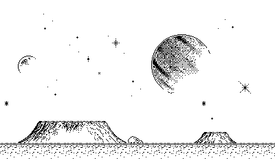

# Playdate Circle Transition

Demonstrates how to implement an
[iris shot](https://en.wikipedia.org/wiki/Iris_shot) (a type of wipe common in
silent film / *Looney Tunes*) to transition between scenes in a Playdate game.



## Running

```
make
```

## Credits

Graphics from Rumblecade's
[Lunar Surface 1-B](https://rumblecade.itch.io/lunar-surface) tileset.
